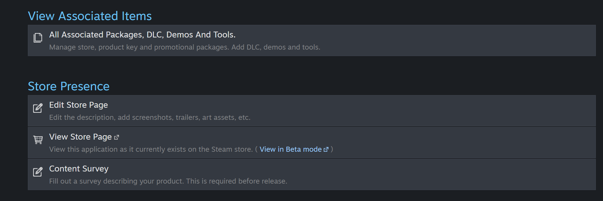
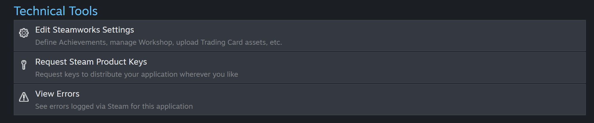
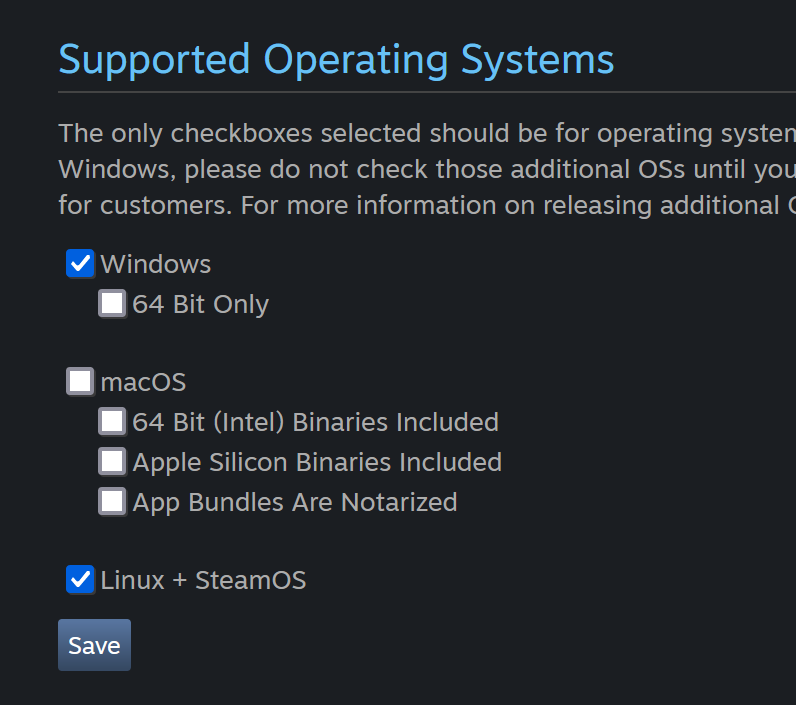
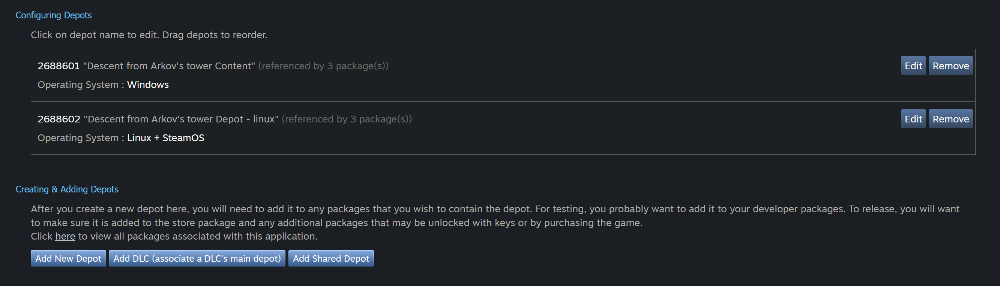
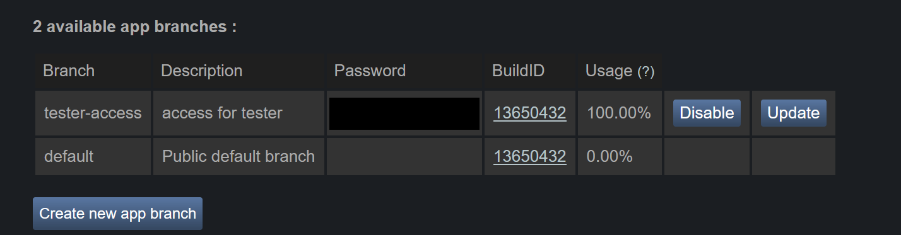
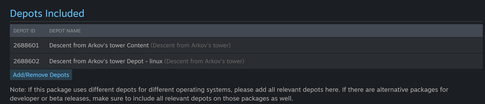
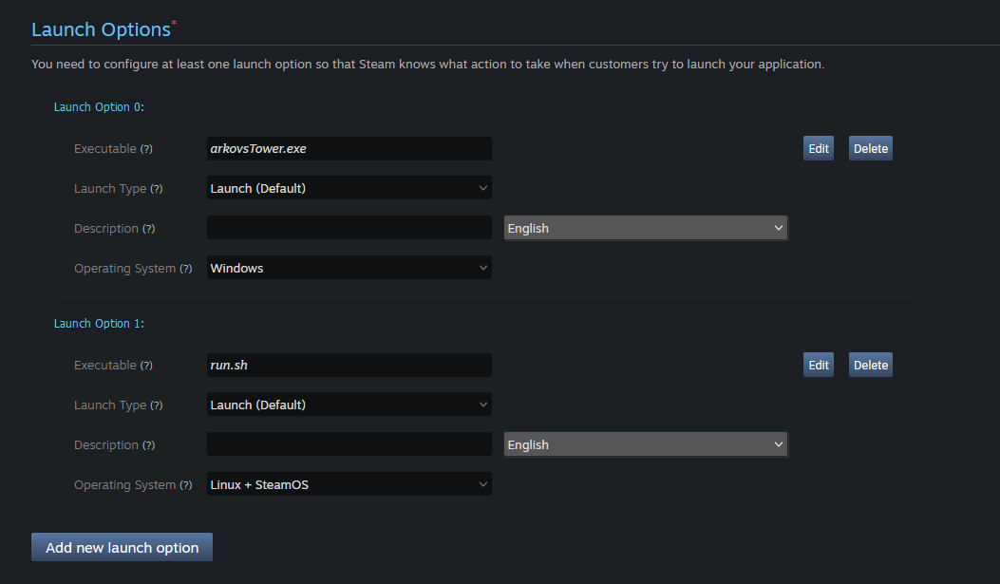
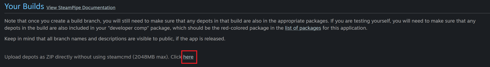
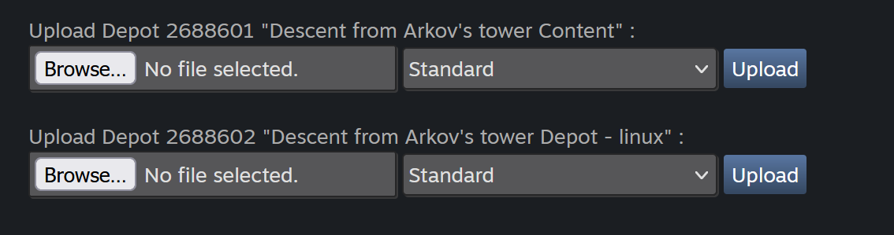

# Disclaimer this was made in 06. March 2024
This is mainly a guide for myself, but maybe others find it helpfull. I hope it is not to far out of date when you find this page :D.

# Basics
Before you can follow these steps you will have to create a new App on Steam (yes you have to pay 100.-$).
Then you have to create a new Project and giving it a Name. In my case it was "Descen from Arkov's Tower".

# Create your Games store page
1. In your Dashboard you should see a Selection of Applications. At least the one you have created should be visible.
2. Click on it and get to your Apps Overview.



3. Near the top you should find: "Edit Store Page"
4. Click on it
5. In hear you will find a lot of stuff to provide... I will not include all of it as it will probably be outdated soon anyway

| :warning: WARNING           |
|:----------------------------|
| Everytime you have edited a part in this view, you will have to publish in its publish tab. Saving on a given page is not enough |

# Providing Game files (builds) to clients
1. In your Dashboard you should see a Selection of Applications. At least the one you have created should be visible.
2. Click on it and get to your Apps Overview



3. Near the top you should find "Edit SteamWorks Settings"
4. Click on it
5. Now you are in the settings for your games files / build / packages / depots, you know the complicated stuff.

| :warning: WARNING           |
|:----------------------------|
| Everytime you have edited a part in this view, you will have to publish in its publish tab. Saving on a given page is not enough |

## Application tab
1. Not sure if you have to give a Name here, I think it will take the one wich you entered when created the App
2. Specify used OS In my Case Linux and Windows



I left the rest as is (default)

## Steampipe Tab Option "Depos"

| :warning: WARNING           |
|:----------------------------|
| This is the Tab where you will upload new versions (builds) of your game |

1. navigate to Steam pipe Tab and select the sub option: "Depots"
2. In the section "Configurating depos" Make sure to have a depo for each OS. In my case I use the default (already existing) depo for windows and created a new one for linux



## Steampipe Tab Option "builds"

3. Navigate to Steampipe builds option
4. create a new branch (the blacked out part is the password wich you can use) I created a "tester-access" branch in order to have a secondary branch wich will hold my builds that should not yet be public



## Add Depots to all packages
1. In the Navbar on the Toppage navigate to "Packages"
2. In my case I see 3 Packages for my Game

| Package name | description |
| ------------ | ----------- |
| Descent from Arkov's tower Developer Comp | developer builds? not sure |
| Descent from Arkov's tower for Beta Testing | beta-tester branch |
| Descent from Arkov's tower | users / live build (default branch) |

3. Please note that the life build will only be available if steam has checked your build and approved it (for the first time)
4. Now click on each Package and make sure that the depos for all OS are included. Bellow I show one example, it has to look like this for all (in my case) 3 packages.



5. In my case I use the already existing depot for windows and added the one for Linux

## Launch Options

1. Now we have to define how the game will get started for each OS. On my case for windows this is with an .exe file, for linux it is a shell script run.sh.
2. Navigate to the "Installations" tab
3. Add a Launch Option for all OS's you plan to have. In my case a linux and a windows.
4. Both OS's version need a different entry point, in case of windows it will be `arkovsTower.exe`, in case of Linux in my case it is `run.sh`




## Actually uploading builds
1. . Now we can upload a new build for this click the bellow marked "here"



2. upload a file for each OS (you should see one upload field for each OS, if not you might have not completed one of the before steps)



3. Please note that each build should be a zip file wich contains the .exe file or the occording file at the root level. So: 

```
myWindows.zip
 |--arkovsTower.exe.exe
 |--libs (just an example)
     |...
```

```
myLinux
 |--run.sh
 |--libs (just an example)
      |...
```

4. once uploaded you can choose a branch on wich to upload. For the first upload lets go with the `tester-access` branch, but make sure to repeat it also for the `default`, at latest on release!
